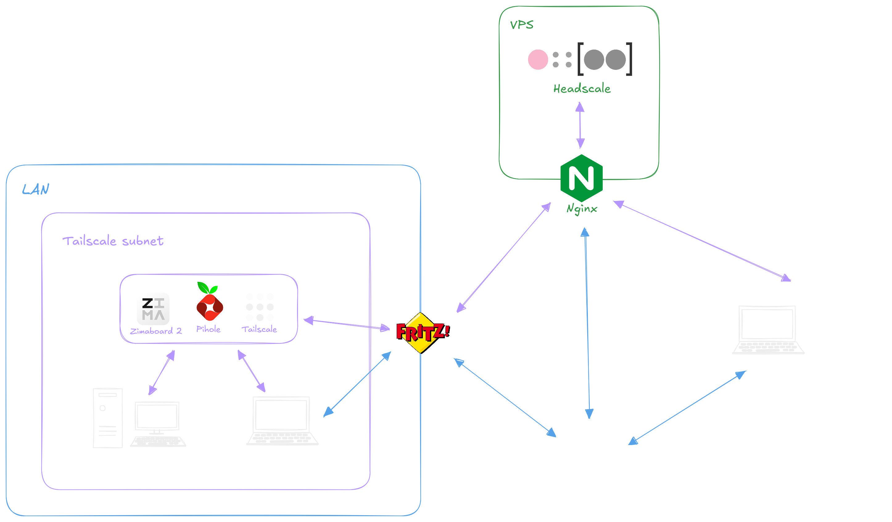

# Homelab Setup

My personal homelab built on **Talos Linux** and powered by **Kubernetes**. The infrastructure features a self-hosted mesh VPN (Headscale/Tailscale). Fully automated using **Ansible**, and managed via GitOps with **FluxCD**.

---

## Deployed Services

- **Homepage**: Personal dashboard and landing page.
- **Pi-hole**: Network-wide ad blocking and DNS server.
- **Nginx Proxy Manager**: Reverse proxy for exposing services.
- **Actual Budget**: Personal finance management.
- **Tailscale**: Secure remote access to the cluster (Mesh VPN).
- **MetalLB**: Bare metal load balancer implementation.
- **n8n**: Workflow automation tool.
- **Cloudflared**: Cloudflare Tunnel for secure external access.

---

## Development Environment

This project is configured with a **Dev Container**. To ensure consistency, all necessary tools are pre-installed and configured within the container:
* `kubectl`
* `kubeconform`
* `talosctl`
* `flux`
* `ansible`
* `sops`
* `age`
* `helm`
* `yq`
* `direnv`

All the required environment variables are defined in the file `.env.example` use them in your `.env` file.

---

## 1. VPS Setup (Headscale)

This project uses an external VPS to host **Headscale** (a self-hosted Tailscale control server). The setup includes Nginx as a reverse proxy with WebSocket support, Fail2Ban for SSH protection, and automatic SSL certificates via Let's Encrypt.



### Prerequisites

1.  A fresh VPS (Ubuntu/Debian recommended).
2.  A DNS A Record pointing to your VPS IP (e.g., `headscale.yourdomain.com`).
3.  SSH access to the VPS.

### Configuration & Deployment

Run the Ansible playbook to provision the VPS:

```bash
ansible-playbook -i ansible/inventory.yaml ansible/vps/setup-headscale.yaml
```

## 2. Cluster Setup

### Secrets Management

#### 1. Clean up existing secrets:

```bash
rm -f talos/secrets/secret.yaml \
      apps/pi-hole/secret.yaml \
      apps/tailscale/secret.yaml
```

#### 2. Generate new secrets:

Create apps/pi-hole/secret.yaml:

```yaml
apiVersion: v1
kind: Secret
metadata:
    name: pihole-secret
    namespace: pihole
stringData:
    password: YOUR_PIHOLE_PASSWORD
```

Create apps/tailscale/secret.yaml:

```yaml
apiVersion: v1
kind: Secret
metadata:
    name: tailscale-authkey
    namespace: tailscale
type: Opaque
stringData:
    TS_AUTHKEY: YOUR_TAILSCALE_AUTHKEY # Generate this via your Headscale CLI
```

> **Note**: The main Talos secret (`talos/secrets/secret.yaml`) will be generated automatically by Ansible playbook during the playbook execution.

### Encryption (SOPS)

Generate an `age` key pair for SOPS encryption:

```bash
age-keygen -o key.txt
export SOPS_AGE_KEY_FILE=key.txt
```

> **Important**: Edit .sops.yaml to add your new age public key under the age section.

Encrypt the application secrets:

```bash
sops -e -i apps/pihole/secret.yaml
sops -e -i apps/tailscale/secret.yaml
# Note: talos/secrets/secret.yaml does not exist yet, so we don't encrypt it here.
```

---

## Provisioning

Run the playbook to initialize the cluster:

```bash
ansible-playbook -i ansible/inventory.yaml ansible/cluster/setup-cluster.yaml
```

Finalize Security: Once the playbook finishes, encrypt the newly generated Talos secret:

```bash
sops -e -i talos/secrets/secret.yaml
```

FluxCD will now automatically deploy the applications defined in clusters/homelab/apps.

> **Note**: This is a single-node configuration. Ensure you edit `talos/patches/patch.yaml` to set the correct installation disk for your hardware.

---

## Maintenance & Operations

### Patch Cluster Configuration

This workflow decrypts the config, applies patches using Ansible, and re-encrypts the secrets.

#### 1. Decrypt Talos Secret

```bash
sops -d -i talos/secrets/secret.yaml
```

#### 2. Apply Patch

* Exports current cluster config to `talos/config`.

* Applies patches from `talos/patches/patch.yaml`.

* Applies changes to the node.

```bash
ansible-playbook -i ansible/inventory.yaml ansible/cluster/patch-cluster.yaml
```

#### 3. Encrypt Talos Secret

```bash
sops -e -i talos/secrets/secret.yaml
```

### Recover Cluster Configuration

Use this to regenerate the `kubeconfig` and `talosconfig` locally from the running cluster.

#### 1. Decrypt Talos Secret

```bash
sops -d -i talos/secrets/secret.yaml
```

#### 2. Recover:

* Exports current cluster config including `kubeconfig` to `talos/config`.

```bash
ansible-playbook -i ansible/inventory.yaml ansible/cluster/recover-cluster.yaml
```

#### 3. Encrypt Talos Secret

```bash
sops -e -i talos/secrets/secret.yaml
```